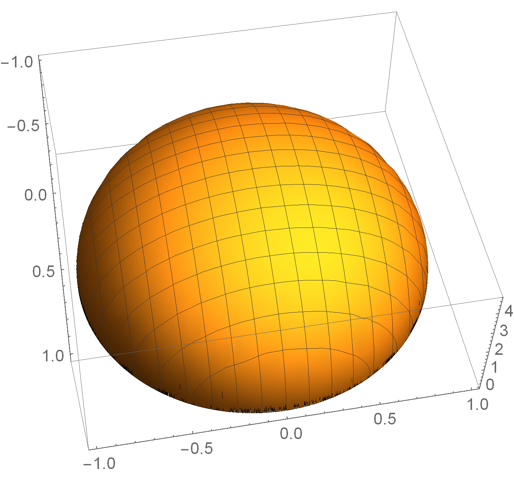

# Mathematical Statistics and Data Analysis

## Joint Distributions

## 11810105 谢泽健

### 1.

#### a.

$$
f_X(x)=\left\{\begin{array}{ll}{0.10+0.05+0.02+0.02=0.19} & {x=1} \\ {0.05+0.20+0.05+0.02=0.32} & {x=2}  \\ {0.02+0.05+0.20+0.04=0.31} & {x=3}\\
{0.02+0.02+0.04+0.10=0.18} & {x=4}
\end{array}\right.
$$

$$
f_Y(y)=\left\{\begin{array}{ll}{0.10+0.05+0.02+0.02=0.19} & {y=1} \\ {0.05+0.20+0.05+0.02=0.32} & {y=2}  \\ {0.02+0.05+0.20+0.04=0.31} & {y=3}\\
{0.02+0.02+0.04+0.10=0.18} & {y=4}
\end{array}\right.
$$

#### b.

$$
f_{X|Y=1}(x)=\left\{\begin{array}{ll}{\frac{f(1,1)}{P(Y=1)}=\frac{0.1}{0.19}=0.5263} & {x=1} \\ {\frac{f(1,2)}{P(Y=1)}=\frac{0.05}{0.19}=0.2632} & {x=2}  \\ {\frac{f(1,3)}{P(Y=1)}=\frac{0.02}{0.19}=0.1053} & {x=3}\\
{\frac{f(1,4)}{P(Y=1)}=\frac{0.02}{0.19}=0.1053} & {x=4}
\end{array}\right.
$$

$$
f_{Y|X=1}(x)=\left\{\begin{array}{ll}{\frac{f(1,1)}{P(Y=1)}=\frac{0.1}{0.19}=0.5263} & {y=1} \\ {\frac{f(1,2)}{P(Y=1)}=\frac{0.05}{0.19}=0.2632} & {y=2}  \\ {\frac{f(1,3)}{P(Y=1)}=\frac{0.02}{0.19}=0.1053} & {y=3}\\
{\frac{f(1,4)}{P(Y=1)}=\frac{0.02}{0.19}=0.1053} & {y=4}
\end{array}\right.
$$

### 9.

#### a.

​	区域面积为
$$
S=\int_{-1}^{1}\left(1-x^{2}\right) d x=\left.\left(x-\frac{x^{3}}{3}\right)\right|_{-1} ^{1}=1-\frac{1}{3}-\left(-1-\frac{-1}{3}\right)=\frac{4}{3}
$$
​	所以
$$
f(x,y)=\frac{1}{4/3}=\frac{3}{4}
$$

$$
f_X(x)=\int_{0}^{1-x^{2}} \frac{3}{4} d y=\frac{3}{4}(1-x^2)\quad-1\le x\le1
$$

$$
f_Y(y)=\int_{-\sqrt{1-y}}^{\sqrt{1-y}} \frac{3}{4} d x=\frac{3}{2}\sqrt{1-y}\quad0\le y\le1
$$

#### b.

$$
f_{X|Y}(x,y)=\frac{f(x,y)}{f_Y(y)}=\frac{1}{2\sqrt{1-y}}
$$

$$
f_{Y|X}(x,y)=\frac{f(x,y)}{f_X(x)}=\frac{1}{1-x^2}
$$

### 10.

#### a.

$$
f_Y(y)=\int_{0}^{\infty} xe^{-x(y+1)} d x=\frac{1}{1+y^2}
$$

$$
f_X(x)=\int_{0}^{\infty} xe^{-x(y+1)} d y=\frac{1}{e^x}
$$

​	$f_X(x)f_Y(y)\neq f(x,y)$, 故 $X$ 和 $Y$ 不独立

#### b.

$$
f_{X|Y}(x,y)=\frac{f(x,y)}{f_Y(y)}=xe^{-x(1+y)}\left(1+y^{2}\right)
$$

$$
f_{Y|X}(x,y)=\frac{f(x,y)}{f_X(x)}=xe^{x-x(1+y)}
$$

### 15.

#### a.

$$
\iint_{x^{2}+y^{2} \leqslant 1}{c \sqrt{1-x^{2}-y^{2}}dxdy}=c\iint_{x^{2}+y^{2} \leqslant 1}{ \sqrt{1-x^{2}-y^{2}}dxdy}=\frac{2 \pi}{3}c
$$

​	所以
$$
c=\frac{3}{2 \pi}
$$

#### b.

#### c.

$$
P\left(X^{2}+Y^{2} \leqslant \frac{1}{2}\right)=\iint_{x^{2}+y^{2} \leq\left(\frac{\sqrt{2}}{2}\right)^{2}}  \sqrt{1-\left(x^{2}+y^{2}\right)} d x d y=1-\frac{\sqrt{2}}{4}
$$

#### d.

$$
f_X(x)=\int_{-\sqrt{1-x^{2}}}^{\sqrt{1-x^{2}}} \frac{3}{2 \pi}  \sqrt{1-x^{2}-y^{2}} d y=\frac{3}{4} \left(1-x^{2}\right)
$$

​	同理可得
$$
f_Y(y)=\frac{3}{4} \left(1-y^{2}\right)
$$
​	验证
$$
	f_X(x)f_Y(y)\neq f(x,y)
$$
​	故 $X$ 和 $Y$ 不独立

#### e.

$$
f_{X|Y}(x,y)=\frac{f(x,y)}{f_Y(y)}=\frac{2}{\pi}  \frac{\sqrt{1-x^{2}-y^{2}}}{1-y^{2}}
$$

同理
$$
f_{Y|X}(x,y)=\frac{2}{\pi}  \frac{\sqrt{1-x^{2}-y^{2}}}{1-x^{2}}
$$

### 19

#### a.

$$
f_{T_1}(t_1)=\alpha \cdot e^{-\alpha t_{1}}
$$

$$
f_{T_2}(t_2)=\beta \cdot e^{-\beta t_{2}}
$$

​	所以联合分布为
$$
f_{T_{1}, T_{2}}\left(t_{1}, t_{2}\right)=f_{T_{1}}\left(t_{1}\right) \cdot f_{T_{2}}\left(t_{2}\right)=\alpha  e^{-\alpha t_{1}}  \beta  e^{-\beta t_{2}}
$$

$$
\begin{aligned} P\left(T_{1}>T_{2}\right)=& \iint_{t_{1}>t_{2}} f\left(t_{1}, t_{2}\right) d t_{1} d t_{2}\\=&\iint_{t_{1}>t_{2}} f_{T_{1}}\left(t_{1}\right) \cdot f_{T_{2}}\left(t_{2}\right)  \\=& \int_{0}^{+\infty}\left(\int_{t_{2}}^{+\infty} \alpha \cdot e^{-\alpha t_{1}} \cdot \beta \cdot e^{-\beta t_{2}} d t_{1}\right) d t_{2} \\=&\left.\int_{0}^{+\infty} \alpha \cdot \beta \cdot e^{-\beta t_{2}} \cdot\left(-\frac{e^{-\alpha t_{1}}}{\alpha}\right)\right|_{t_{2}} ^{+\infty} d t_{2}=\int_{0}^{+\infty} \beta \cdot e^{-(\alpha+\beta) t_{2}} d t_{2} \\=&\left.\beta \cdot\left(-\frac{e^{-(\alpha+\beta) t_{2}}}{\alpha+\beta}\right)\right|_{0} ^{+\infty}
\\=&\frac{\beta}{\alpha+\beta}\end{aligned}
$$

#### b.

$$
\begin{aligned} P\left(T_{1}>2 T_{2}\right)=& \int_{t_{1}>2 t_{2}} f\left(t_{1}, t_{2}\right) d t_{1} d t_{2}\\=&\iint_{t_{1}>2 t_{2}} f_{T_{1}}\left(t_{1}\right) \cdot f_{T_{2}}\left(t_{2}\right) \\=& \int_{0}^{+\infty}\left(\int_{2 t_{2}}^{+\infty} \alpha \cdot e^{-\alpha t_{1}} \cdot \beta \cdot e^{-\beta t_{2}} d t_{1}\right) d t_{2} \\=&\left.\int_{0}^{+\infty} \alpha \cdot \beta \cdot e^{-\beta t_{2}} \cdot\left(-\frac{e^{-\alpha t_{1}}}{\alpha}\right)\right|_{2 t_{2}} ^{+\infty} d t_{2}=\int_{0}^{+\infty} \beta \cdot e^{-(2 \alpha+\beta) t_{2}} d t_{2} \\=&\left.\int_{0}^{+\infty} \alpha \cdot \beta \cdot e^{-\beta t_{2}} \cdot\left(-\frac{e^{-\alpha t_{1}}}{\alpha}\right)\right|_{2 t_{2}} ^{+\infty} d t_{2}=\int_{0}^{+\infty} \beta \cdot e^{-(2 \alpha+\beta) t_{2}} d t_{2} \\=&\left.\beta \cdot\left(-\frac{e^{-(2 \alpha+\beta) t_{2}}}{2 \alpha+\beta}\right)\right|_{0} ^{+\infty} \\=& \frac{\beta}{2 \alpha+\beta}
\end{aligned}
$$

### 补充题

​	点$P,Q$服从均匀分布, 记 $h$ 为底边的高
$$
f_{X Y}(x, y)=\left\{\begin{array}{ll}{\frac{2}{h \cdot B C},(x, y) \in \Delta A B C} \\ {0},\text{其他}\end{array}\right.
$$

$$
f_{Z}(z)=\left\{\begin{array}{ll}{\frac{1}{B C}, z \in(0, B C)} \\ {0, \quad其他}\end{array}\right.
$$

​	所以
$$
f(x, y, z)=f_{X Y}(x, y) f_{Z}(z)
$$
​	PQ于线段AB相交等价于
$$
P((x, y) \in \Delta A B Q,0<z<BC)=\frac{1}{2}
$$

### 思考题

​	设三条线段长分别为 $x,y,d-x-y$

​	依题意
$$
f(x)=\frac{1}{d}\\
f_{Y|X}(y)=\frac{1}{d-x}
$$

​	所以
$$
f(x,y)=\frac{1}{d(d-x)}
$$

$$
P(构成三角形)=\iint_{0<x<\frac{d}{2},\frac{d}{2}-x<y<\frac{d}{2}}\frac{1}{d(d-x)}dxdy=\int_0^{d/2}\int_{d/2-x}^{d/2}\frac{1}{d(d-x)}dydx=ln2-1/2
$$

​	