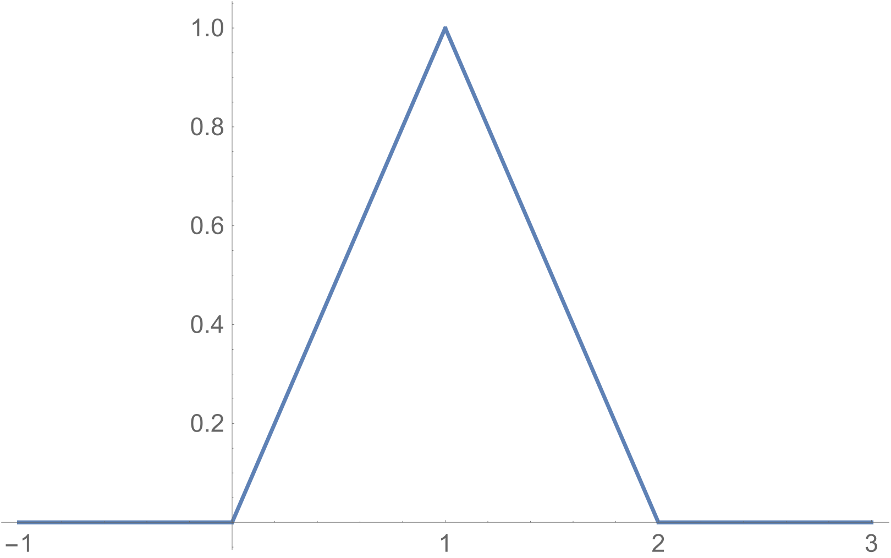

# Mathematical Statistics and Data Analysis

## Joint Distributions

## 11810105 谢泽健

### 43.

​		$U_1$  和  $U_2$ 的分布均为
$$
f_{U_{1}}(u)=f_{U_{2}}(u)=1, \quad u \in[0,1]
$$
​		由卷积公式
$$
f_{S}(s)=\int_{-\infty}^{\infty} f_{U_1}(u) f_{U_2}(s-u) \mathrm{d} u
$$
​		当 $0\le s\le1$
$$
f_{S}(s)=\int_{0}^{s} f_{U_1}(u) f_{U_2}(s-u) \mathrm{d} u=\int_{0}^{s} 1 \mathrm{d} u=s
$$
​		当 $0\le s\le1$
$$
f_{S}(s)=\int_{s-1}^{1} f_{U_1}(u) f_{U_2}(s-u) \mathrm{d} u=\int_{s-1}^{1} 1 \mathrm{d} u=2-s
$$
​		综上
$$
f_{S}(s)=\left\{\begin{array}{ll}{s} & {s \in[0,1]} \\ 
{2-s} & {s \in(1,2]}
\\ 0 & else
\end{array}\right.
$$

### 44.

​		$U_1$  和  $U_2$ 的分布均为
$$
p_{U}(u)=\left\{\begin{array}{ll}
{\frac{1}{3}} & {u=0} \\ 
{\frac{1}{3}} & {u=1}\\
{\frac{1}{3}} & {u=2}
\end{array}\right.
$$
​		由卷积公式
$$
P\left(Z=z_{l}\right)=\sum_{i=1}^{\infty} P\left(X=x_{i}\right) P\left(Y=z_{l}-x_{i}\right)
$$
​		当 $0\le z\le2$
$$
p_{Z}(z)=\sum_{i=0}^{z} P\left(X=i\right) P\left(Y=z-i\right)=\sum_{i=0}^{z} \frac{1}{9} =\frac{z+1}{9}
$$
​		当 $2< z\le4$
$$
p_{Z}(z)=\sum_{i=z-2}^{2} P\left(X=i\right) P\left(Y=z-i\right)=\sum_{i=z-2}^{2} \frac{1}{9} =\frac{5-z}{9}
$$
​		综上

| Z    | 0             | 1             | 2             | 3             | 4             |
| ---- | ------------- | ------------- | ------------- | ------------- | ------------- |
| P    | $\frac{1}{9}$ | $\frac{2}{9}$ | $\frac{3}{9}$ | $\frac{2}{9}$ | $\frac{1}{9}$ |

### 51.

​		令
$$
\left\{\begin{array}{r}{x  y=z} \\ {y=y}\end{array}\right.
$$
​		Jacobi式为
$$
\frac{\partial(x, y)}{\partial(z, y)}=\left|\begin{array}{ll}{\frac{1}{y}} & {\frac{-z}{y^2}} \\ {0} & {1}\end{array}\right|=\left|\frac{1}{y}\right|
$$
​		于是
$$
F_{Z}(z)=\int_{-\infty}^{z}\left(\int_{-\infty}^{+\infty} f(\frac{u}{y}, y)\left|\frac{1}{y}\right| \mathbf{d} y\right) \mathbf{d} u
$$
​		所以
$$
f_{Z}(z)=\int_{-\infty}^{+\infty} f(\frac{z}{y}, y)|\left|\frac{1}{y}\right|| \mathbf{d} y
$$

### 52.

​		令 $X$ 和 $Y$ 均为 均匀变量, 它们的联合分布为
$$
f_{XY}(x,y)=1
$$
​		令
$$
\left\{\begin{array}{r}{\frac{x}{y}=z} \\ {y=y}\end{array}\right.
$$
​		Jacobi式为
$$
\frac{\partial(x, y)}{\partial(z, y)}=\left|\begin{array}{ll}{y} & {u} \\ {0} & {1}\end{array}\right|=\left|y\right|
$$
​		于是
$$
F_{Z}(z)=\int_{-\infty}^{z}\left(\int_{-\infty}^{+\infty} f(u y, y)\left|y\right| \mathbf{d} y\right) \mathbf{d} u
$$
​		所以

​		当 $z>1$
$$
\begin{aligned}
f_{Z}(z)=&\int_{-\infty}^{+\infty} f_{XY}(zy, y)\left|y\right| \mathbf{d} y
\\=&\int_{0}^{\frac{1}{z}} \left|y\right| \mathbf{d} y
\\=&\frac{1}{2z^2}
\end{aligned}
$$

​		当 $0\le z\le1$
$$
\begin{aligned}
f_{Z}(z)=&\int_{-\infty}^{+\infty} f_{XY}(zy, y)\left|y\right| \mathbf{d} y
\\=&\int_{0}^{1} \left|y\right| \mathbf{d} y
\\=&\frac{1}{2}
\end{aligned}
$$
​		综上
$$
f_{Z}(z)=\left\{\begin{array}{ll}{\frac{1}{2z^2}} & {z \in(1,\infty)} \\ 
\frac{1}{2} & {z \in[0,1]}
\\ 0 & else
\end{array}\right.
$$

### 57.

​		$Y_1$ 和 $Y_2$ 的联合分布为
$$
f_{Y_1Y_2}(y_1,y_2)=\frac{e^{-y_1^2+y_2 y_1-\frac{y_2^2}{2}}}{2 \pi }
$$
​		用已知得
$$
\left(
\begin{array}{cc}
 a_{11} & a_{12} \\
 a_{21} & a_{22} \\
\end{array}
\right).\left(
\begin{array}{c}
 y_1 \\
 y_2 \\
\end{array}
\right)=\left(
\begin{array}{c}
 x_1 \\
 x_2 \\
\end{array}
\right)
$$
​		取矩阵的逆得到
$$
\left(
\begin{array}{cc}
 \frac{a_{22}}{a_{11} a_{22}-a_{12} a_{21}} & -\frac{a_{12}}{a_{11} a_{22}-a_{12} a_{21}} \\
 -\frac{a_{21}}{a_{11} a_{22}-a_{12} a_{21}} & \frac{a_{11}}{a_{11} a_{22}-a_{12} a_{21}} \\
\end{array}
\right).\left(
\begin{array}{c}
 x_1 \\
 x_2 \\
\end{array}
\right)=\left(
\begin{array}{c}
 y_1 \\
 y_2 \\
\end{array}
\right)
$$
​		Jacobi式为
$$
\frac{\partial(y_1, y_2)}{\partial(x_1, x_2)}=\left|
\begin{array}{cc}
 \frac{a_{22}}{a_{11} a_{22}-a_{12} a_{21}} & -\frac{a_{12}}{a_{11} a_{22}-a_{12} a_{21}} \\
 -\frac{a_{21}}{a_{11} a_{22}-a_{12} a_{21}} & \frac{a_{11}}{a_{11} a_{22}-a_{12} a_{21}} \\
\end{array}
\right|=\left|\frac{1}{a_{11} a_{22}-a_{12} a_{21}}\right|
$$
​		$X_1$ 和 $X_2$ 的联合分布为
$$
f_{X_1X_2}(x_1,x_2)=\frac{\exp \left(-\frac{\left(a_{21}^2+2 a_{22} a_{21}+2 a_{22}^2\right) x_1^2+\left(-2 a_{11} a_{21}-2 a_{12} a_{21}-2 a_{11} a_{22}-4 a_{12} a_{22}\right) x_2 x_1+\left(a_{11}^2+2 a_{12} a_{11}+2 a_{12}^2\right) x_2^2}{2 \left(a_{12} a_{21}-a_{11} a_{22}\right){}^2}\right)}{2 \pi }
$$
​		若 $X_1$ 和 $X_2$ 均为标准正态随机变量, 
$$
f_{X_1X_2}(x_1,x_2)=\frac{e^{\frac{1}{2} \left(-x^2-y^2\right)}}{2 \pi }
$$
​		解得
$$
\left(
\begin{array}{cc}
 a_{11} & a_{12} \\
 a_{21} & a_{22} \\
\end{array}
\right)=\left(
\begin{array}{cc}
 1 & 0 \\
 -1 & 1 \\
\end{array}
\right)
$$

### 70.

$$
\begin{aligned} F(x, y) &=\mathrm{P}\left(X_{n} \leqslant y\right)-\mathrm{P}\left(X_{1}>x, X_{n} \leqslant y\right) \\ &=[F(y)]^{n}-\mathrm{P}\left(x<X_{1} \leqslant y, x<X_{2} \leqslant y,\cdots, x<X_{n} \leqslant y\right) \\ &=[F(y)]^{n}-\prod_{i=1}^{k} \mathrm{P}\left(x<X_{i} \leqslant y\right) \\ &=[F(y)]^{n}-[F(y)-F(x)]^{k} \end{aligned}
$$

​		

